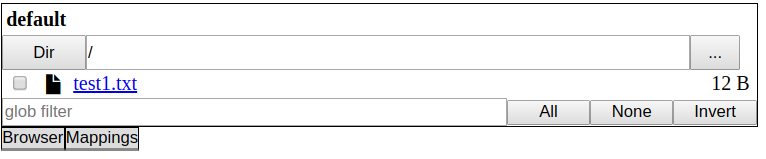
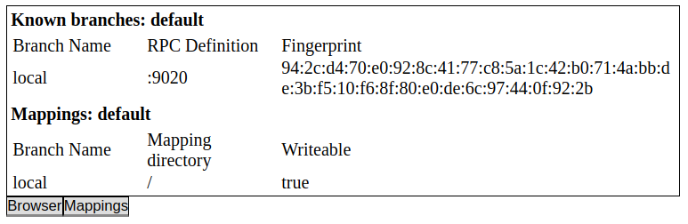
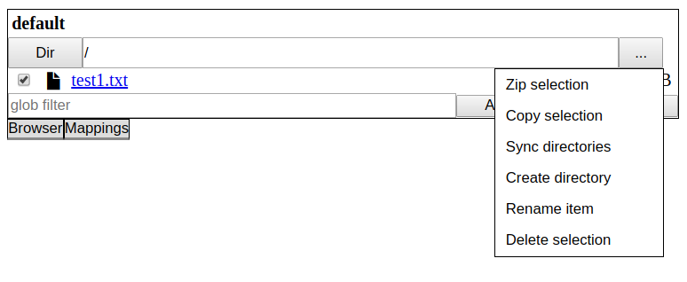

Rufs Tutorial
=============
The following tutorial will give you an overview of the main features of Rufs. It shows how to run a simple local file share.

The tutorial assumes you have downloaded Rufs and extracted it. Switch to the directory `examples/tutorial`. This example will demonstrate a simple local fileshare. Run `./start_server.sh` (Linux) or `start_server.bat` (Windows) to start the server. You should see start messages:
```
Rufs 1.0.0
Using secret from: rufs.secret
Using ssl key.pem and cert.pem from: ssl
Using config: rufs.server.json
Exporting folder: <absolute path to rufs>/examples/tutorial/run/share
2019/08/10 21:12:59 local: Starting node local rpc server on: :9020
2019/08/10 21:12:59 local: SSL fingerprint: <some long fingerprint>
```
The created `run` folder contains all runtime files. The created `rufs.secret` file is the `password` to the server and is never transmitted over the network. The client needs this file in order to communicate with the server.

The next step is to start the client. The simplest client is the Rufs CLI. Run `./start_term_client.sh` (Linux) or `start_term_client.bat` (Windows) to start the command-line client. You should see start messages and a prompt:
```
Rufs 1.0.0
Using secret from: rufs.secret
Using ssl key.pem and cert.pem from: ssl
Using mapping file: rufs.mapping.json
Type 'q' or 'quit' to exit the shell and '?' to get help
>>>
```
The client will automatically connect to the running server. Run a few commands:
```
>>>branch
local [94:2c:d4:70:e0:92:8c:41:77:c8:5a:1c:42:b0:71:4a:bb:de:3b:f5:10:f6:8f:80:e0:de:6c:97:44:0f:92:2b]
```
We can see from the `branch` command that only one branch is known in the moment. New branches can be added by writing `branch <branch name> <rpc port>` (e.g. `branch local localhost:9020`).
```
>>>mount
/: local(w)
```
The `mount` command tells us that the branch is mounted as root and allows writing. Branches can be mounted by writing `mount <mount point> <branch name>` (e.g `mount / local`).

Try mounting the local branch again in the subfolders `foo` and `foo2`:
```
>>>mount /foo local
>>>mount /foo2 local
```
The `mount` command should now return the following:
```
>>>mount
/: local(w)
  foo/: local(w)
  foo2/: local(w)  
```
Run the `dir` command to explore the new filesystem:
```
>>>dir
/
drwxrwxrwx  0 B   foo
drwxrwxrwx  0 B   foo2
-rw-r--r-- 12 B   test1.txt
```
Run `help` to see all available commands. You can quit the console by pressing `ctrl+d` or by running the `q` or `quit` command.

Once you are finished exploring the console you can try the web interface by running `./start_web_client.sh` (Linux) or `start_web_client.bat` (Windows) in the `tutorial` folder. This should start a client running a webserver on `localhost:9090`

The web client is a basic graphical interface and designed to be embedded in other web pages with customized styling. The basic interface looks like this:



The current branch mappings can be viewed under the `Mappings` tab:



Files can be downloaded (by clicking on the filename) or uploaded (by dragging a file from the desktop). There are several options available via the menu:


